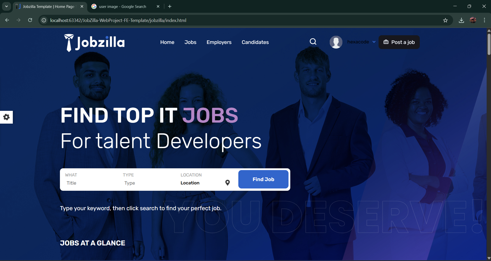
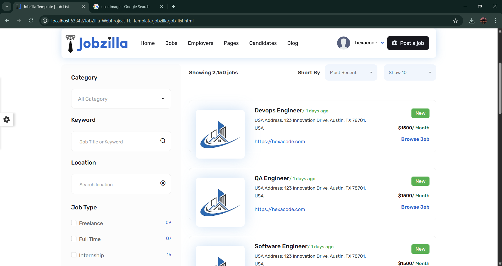
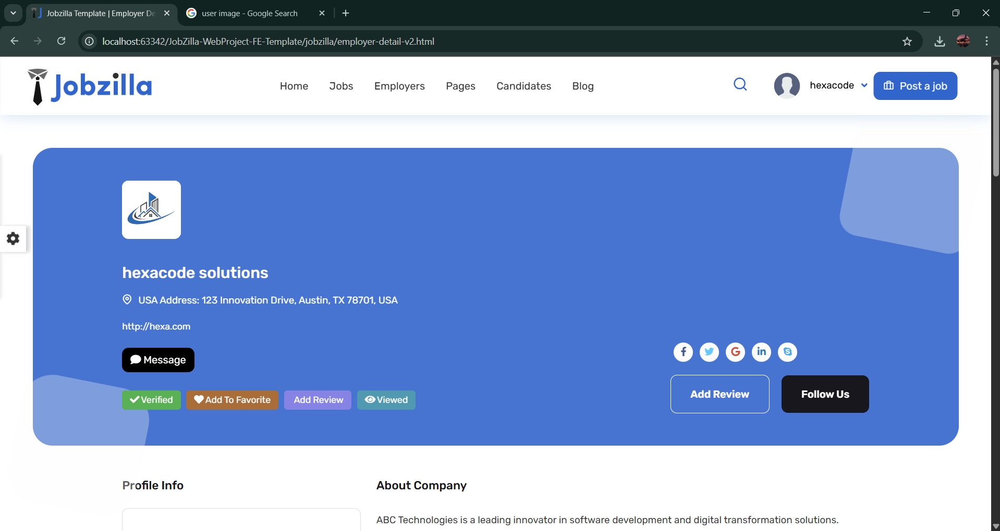
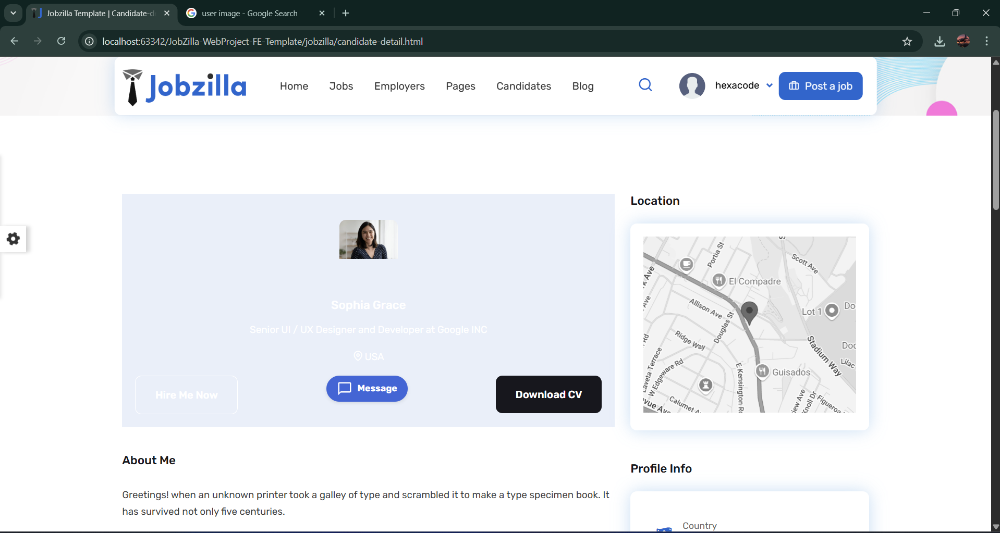
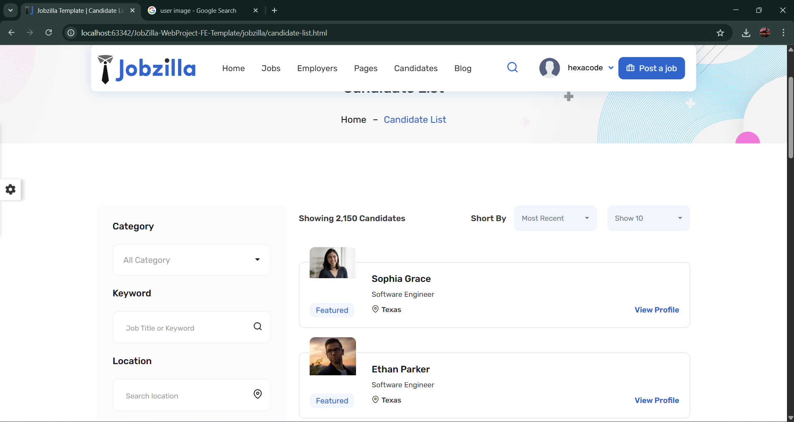
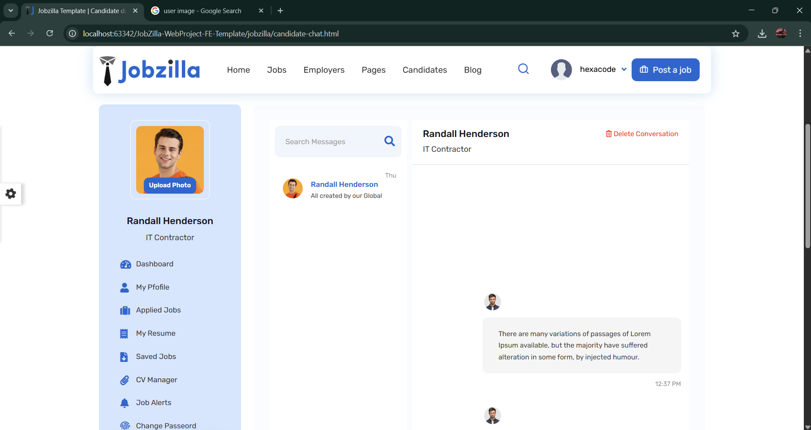
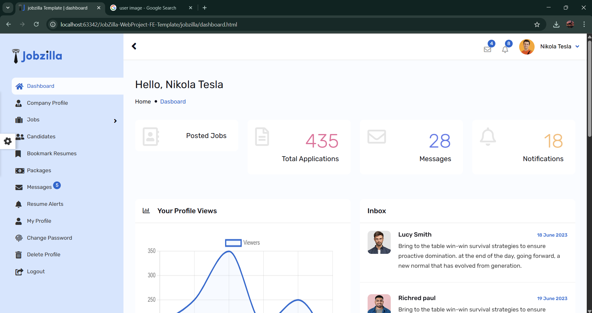

# 🌟 JobZilla 🌟  
**Your Ultimate Job Portal Solution**  

Welcome to JobZilla, a feature-rich and modern web application designed to connect job seekers and employers effortlessly. This project showcases seamless integration of frontend and backend technologies to deliver an intuitive user experience.  

---

## 🚀 Features  
- **Job Listings** 📝: Browse and apply for jobs with ease.  
- **Company Profiles** 🏢: Showcase detailed company information, including logos and job posts.  
- **Search Functionality** 🔍: Filter jobs by category, keyword, and location.  
- **Responsive Design** 📱: Optimized for mobile and desktop devices.  

---

## 🔧 Tech Stack  
- **Backend**: Spring Boot, MySQL, Hibernate  
- **Frontend**: HTML, CSS, JavaScript, jQuery  
- **Build Tools**: Maven  

---

## 📸 Screenshots  

### Home  Page  
  

### Job Listing  
  

### Company Profile  
  

### User Details Page  
  

### user Profile  
  

### chat Page  
  

### Company dashboard  
  

---

## 🎥 YouTube Tutorial  
Watch the complete guide on how to use and set up JobZilla:  
[]([https://youtu.be/rhJC0YZPhEA](https://youtu.be/kS58AzZMUMM))  

---

## 🛠️ How to Run  

1. Clone the repository:  
   ```bash
   git clone https://github.com/keshan200/jobzilla.git
   cd jobzilla
